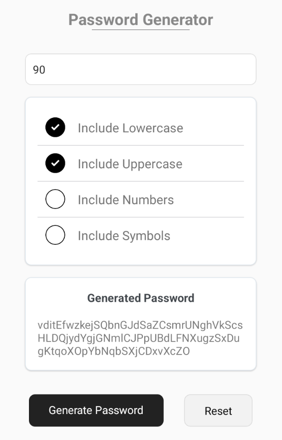

# Password Generator App

## Overview

The Password Generator App is a React Native application that helps users generate secure passwords based on their chosen criteria. Users can select to include lowercase letters, uppercase letters, numbers, and symbols in the generated password. This application validates the password length and ensures at least one option is selected for generating a password.

## Features

- Generate passwords with customizable criteria.
- Options to include lowercase letters, uppercase letters, numbers, and symbols.
- Validation for password length (minimum 4 characters, maximum 100 characters).
- Ability to reset options and generated password.

## Screenshot




## Installation

To get started with this project, follow these steps:

1. **Clone the repository:**
   ```bash
   git clone https://github.com/miraj004/react-native-password-generator-app.git
   cd password-generator-app

2. **Install dependencies**
   ```bash
   npm install

2. **Run the application**
   ```bash
   npx react-native run-android # For Android
   npx react-native run-ios     # For iOS

